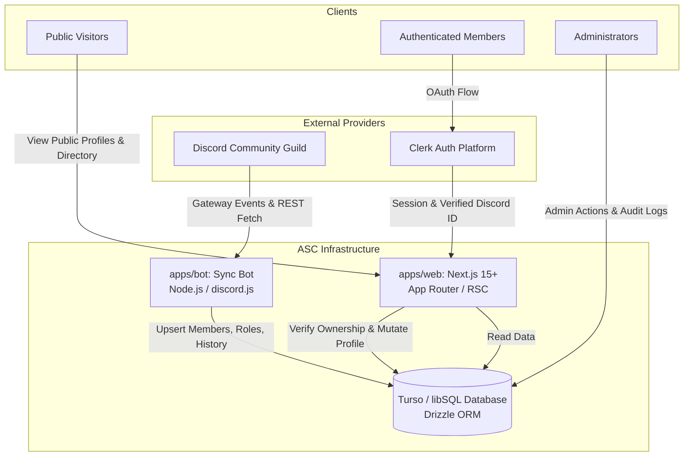

# ASC — Architecture Specification

## 1. System Overview

ASC is architected as an integrated monorepo comprising a Next.js web application, an autonomous Discord synchronization bot, a shared Turso / libSQL database, and shared domain packages.



---

## 2. Core Subsystems

### 2.1 apps/web (Next.js Application)
- **Framework**: Next.js (App Router), React, Tailwind CSS, Lucide icons.
- **Rendering Strategy**:
  - React Server Components (RSC) for public profile rendering and member directory.
  - Server Actions for protected mutations (profile updates, privacy toggles, admin actions).
  - Client components for interactive widgets, live profile preview, and filter controls.
- **Authorization**:
  - Middleware intercepts `/dashboard/*` and `/admin/*`.
  - Server actions re-verify user identity against `users.clerk_user_id` and role permissions before executing mutations.

### 2.2 apps/bot (Discord Synchronization Bot)
- **Framework**: discord.js Gateway client.
- **Role**: Continuous background daemon hosted independently on Docker.
- **Responsibilities**:
  - Ingest real-time guild events (`guildMemberAdd`, `guildMemberRemove`, `guildMemberUpdate`, `userUpdate`).
  - Run full reconciliation loops (startup and configurable interval, default 12h) to heal state drift.
  - Ensure zero manual registration is required for profile existence.

### 2.3 packages/db (Persistence Layer)
- **Database**: Turso (libSQL) in production; local SQLite file mode for offline development and CI.
- **ORM**: Drizzle ORM providing end-to-end type safety, migration tracking, and relational queries.
- **Shared Access**: Consumed by both `apps/web` and `apps/bot`.

### 2.4 Shared Support Packages
- `packages/types`: Shared TypeScript interfaces and enums.
- `packages/validation`: Zod schemas defining trust boundaries for all inputs (bio, links, tags, settings).
- `packages/permissions`: Role bitmasks, permission flags, and server authorization helpers.
- `packages/entitlements`: Dynamic entitlement resolver evaluating supporter and role privileges.
- `packages/config`: Shared compiler and lint configurations.

---

## 3. Data Flow & Lifecycles

### 3.1 Automatic Profile Generation
```text
User Joins Discord Guild
       │
       ▼
Bot receives guildMemberAdd
       │
       ▼
Bot upserts users record (external_user_id)
       │
       ├── Creates default profile record
       ├── Creates primary profile_slugs record (slug = sanitized username)
       ├── Inserts initial membership_periods record (joined_at = now)
       └── Syncs assigned community roles
```

### 3.2 Member Customization & Authentication Linking
```text
Member visits asc.necookie.dev
       │
       ▼
Clicks "Customize Profile" → Redirects to Clerk OAuth (Discord)
       │
       ▼
Clerk returns verified claims:
provider: 'oauth_discord', providerUserId: '123456789'
       │
       ▼
Web checks users table where external_user_id == '123456789'
       │
       ├── Match found: link users.clerk_user_id = clerkUser.id
       └── Redirects to /dashboard with verified ownership
```

### 3.3 Member Departure & Rejoin Lifecycle
```text
Member leaves Discord
       │
       ▼
Bot receives guildMemberRemove
       │
       ▼
Update users.membership_status = 'LEFT'
Update active membership_period.left_at = now
(Profile, bio, links, and custom tags remain INTACT in database)
       │
       ▼
Member rejoins Discord later
       │
       ▼
Bot receives guildMemberAdd
       │
       ▼
Update users.membership_status = 'ACTIVE'
Insert NEW membership_period (joined_at = now)
Previous customizations and slugs are seamlessly restored!
```

---

## 4. Source-of-Truth Boundaries

| Domain Entity | Authoritative System | Synchronization Method |
| :--- | :--- | :--- |
| Canonical Identity | Discord (`snowflake`) | Read-only import via Bot |
| Username & Handle | Discord | Read-only event stream via Bot |
| Community Roles | Discord Guild Roles | Read-only event stream via Bot |
| Supporter Status | Discord Booster / Supporter Role | Read-only event stream via Bot |
| Browser Sessions & OAuth | Clerk | Webhook / Clerk Next.js SDK |
| ASC Profiles & Slugs | Turso / libSQL | ASC Web mutations |
| ASC Custom Bio, Links, Theme | Turso / libSQL | ASC Web mutations |
| Allowed Community Tags | Turso / libSQL | ASC Admin mutations |
| Moderation Actions & Audits | Turso / libSQL | ASC Admin mutations |

---

## 5. Fault Tolerance & Recovery

1. **Bot Process Restart**:
   - The bot is stateless; all state resides in Turso.
   - On startup, the bot triggers a reconciliation pass against the Discord Guild member list, healing any events missed during downtime.
2. **Database Resilience**:
   - All batch operations in the bot use Drizzle transactions.
   - Retries with exponential backoff for transient network issues.
3. **Web Serverless Resilience**:
   - `apps/web` contains no persistent local filesystem dependency and deploys cleanly to Vercel.
   - Database connection uses `@libsql/client` HTTP/WS pooling.
