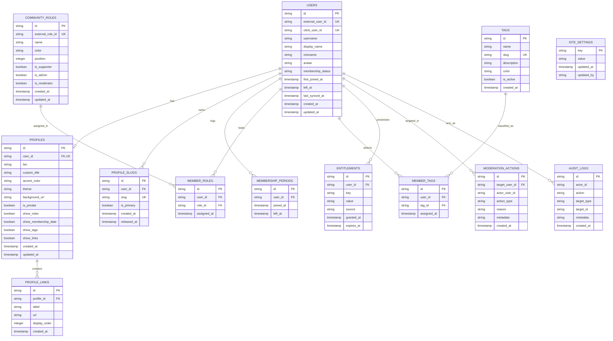

# ASC — Database Specification

## 1. Overview & Technology Stack

The persistence layer is built on **Turso / libSQL** using **Drizzle ORM**.
- **Driver**: `@libsql/client` (supports HTTP/WS for Turso cloud and local SQLite file/memory mode for development and testing).
- **ORM**: Drizzle ORM (`drizzle-orm`, `drizzle-kit`).
- **Migrations**: Generated SQL migrations stored in `packages/db/drizzle/`.

---

## 2. Entity-Relationship Diagram

---

## 3. Table Details & Invariants

### 3.1 `users`
Represents the canonical identity of an ASC community member.
- `id` (`text`, PK, UUID or nanoid): Internal ASC primary identifier.
- `external_user_id` (`text`, NOT NULL, UNIQUE): The immutable Discord Snowflake.
- `clerk_user_id` (`text`, NULLABLE, UNIQUE): Clerk user ID for authenticated sessions.
- `username` (`text`, NOT NULL): Current Discord username (e.g., `necookie`). Presentation only.
- `display_name` (`text`, NOT NULL): Global Discord display name.
- `nickname` (`text`, NULLABLE): Guild-specific server nickname if configured.
- `avatar` (`text`, NULLABLE): URL to current avatar image on Discord CDN.
- `membership_status` (`text`, NOT NULL, DEFAULT `'ACTIVE'`): Enum: `'ACTIVE'`, `'LEFT'`, `'BANNED'`.
- `first_joined_at` (`integer / timestamp`, NOT NULL): When the user first joined the community.
- `left_at` (`integer / timestamp`, NULLABLE): Set when status transitions to `'LEFT'`.
- `last_synced_at` (`integer / timestamp`, NOT NULL): Timestamp of the last bot synchronization pass.
- `created_at` (`integer / timestamp`, NOT NULL)
- `updated_at` (`integer / timestamp`, NOT NULL)

**Indexes**:
- `idx_users_external_user_id` (UNIQUE)
- `idx_users_clerk_user_id` (UNIQUE)
- `idx_users_username`

---

### 3.2 `profiles`
Holds the ASC-specific customization data associated with a member.
- `id` (`text`, PK)
- `user_id` (`text`, NOT NULL, UNIQUE, FK -> `users.id` ON DELETE CASCADE)
- `bio` (`text`, NULLABLE): Markdown-free text biography (max 500 chars).
- `custom_title` (`text`, NULLABLE): Profile title (e.g. "Community Architect"), entitlement-gated.
- `accent_color` (`text`, NULLABLE, DEFAULT `'#5865f2'`): Custom hex accent color adhering to palette.
- `theme` (`text`, NOT NULL, DEFAULT `'canvas'`): Base theme token (`'canvas'`, `'indigo'`, `'onyx'`).
- `background_url` (`text`, NULLABLE): Outbound image URL for profile background (entitlement-gated).
- `is_private` (`integer / boolean`, NOT NULL, DEFAULT `0`): Complete profile privacy toggle.
- `show_roles` (`integer / boolean`, NOT NULL, DEFAULT `1`): Toggle to show community roles publicly.
- `show_membership_date` (`integer / boolean`, NOT NULL, DEFAULT `1`): Toggle to show tenure publicly.
- `show_tags` (`integer / boolean`, NOT NULL, DEFAULT `1`): Toggle to show member tags publicly.
- `show_links` (`integer / boolean`, NOT NULL, DEFAULT `1`): Toggle to show verified links publicly.
- `created_at` (`integer / timestamp`, NOT NULL)
- `updated_at` (`integer / timestamp`, NOT NULL)

---

### 3.3 `profile_slugs`
Manages URL routing and historical slug redirects.
- `id` (`text`, PK)
- `user_id` (`text`, NOT NULL, FK -> `users.id` ON DELETE CASCADE)
- `slug` (`text`, NOT NULL, UNIQUE): URL slug (e.g. `necookie`, `dheyn`).
- `is_primary` (`integer / boolean`, NOT NULL, DEFAULT `1`): Exactly one primary slug per user.
- `created_at` (`integer / timestamp`, NOT NULL)
- `released_at` (`integer / timestamp`, NULLABLE): Timestamp when this slug became an alias due to a username change.

**Routing Invariant**:
- Primary slug responds with `200 OK`.
- Non-primary slug with `released_at IS NOT NULL` triggers `308 Permanent Redirect` to current primary slug.

---

### 3.4 `membership_periods`
Tracks historical community tenure across joins and leaves.
- `id` (`text`, PK)
- `user_id` (`text`, NOT NULL, FK -> `users.id` ON DELETE CASCADE)
- `joined_at` (`integer / timestamp`, NOT NULL): Entry timestamp for this period.
- `left_at` (`integer / timestamp`, NULLABLE): Exit timestamp; `NULL` indicates an active tenure.

---

### 3.5 `community_roles` & `member_roles`
Tracks Discord roles synchronized by the bot.
- `community_roles`:
  - `id` (`text`, PK)
  - `external_role_id` (`text`, NOT NULL, UNIQUE): Discord role Snowflake.
  - `name` (`text`, NOT NULL)
  - `color` (`text`, NOT NULL, DEFAULT `'#5865f2'`)
  - `position` (`integer`, NOT NULL, DEFAULT `0`)
  - `is_supporter` (`integer / boolean`, NOT NULL, DEFAULT `0`)
  - `is_admin` (`integer / boolean`, NOT NULL, DEFAULT `0`)
  - `is_moderator` (`integer / boolean`, NOT NULL, DEFAULT `0`)
- `member_roles`:
  - `id` (`text`, PK)
  - `user_id` (`text`, NOT NULL, FK -> `users.id` ON DELETE CASCADE)
  - `role_id` (`text`, NOT NULL, FK -> `community_roles.id` ON DELETE CASCADE)
  - `assigned_at` (`integer / timestamp`, NOT NULL)
  - **Unique constraint**: `(user_id, role_id)`

---

### 3.6 `tags` & `member_tags`
Admin-curated tags that members can assign to their profiles.
- `tags`:
  - `id` (`text`, PK)
  - `name` (`text`, NOT NULL)
  - `slug` (`text`, NOT NULL, UNIQUE)
  - `description` (`text`, NULLABLE)
  - `color` (`text`, NOT NULL, DEFAULT `'#5865f2'`)
  - `is_active` (`integer / boolean`, NOT NULL, DEFAULT `1`)
- `member_tags`:
  - `id` (`text`, PK)
  - `user_id` (`text`, NOT NULL, FK -> `users.id` ON DELETE CASCADE)
  - `tag_id` (`text`, NOT NULL, FK -> `tags.id` ON DELETE CASCADE)
  - **Unique constraint**: `(user_id, tag_id)`

---

### 3.7 `profile_links`
Outbound verified social and portfolio links.
- `id` (`text`, PK)
- `profile_id` (`text`, NOT NULL, FK -> `profiles.id` ON DELETE CASCADE)
- `label` (`text`, NOT NULL)
- `url` (`text`, NOT NULL)
- `display_order` (`integer`, NOT NULL, DEFAULT `0`)

---

### 3.8 `entitlements`
Flexible capability grants for special features.
- `id` (`text`, PK)
- `user_id` (`text`, NOT NULL, FK -> `users.id` ON DELETE CASCADE)
- `key` (`text`, NOT NULL): e.g. `'profile.background'`, `'profile.custom_title'`, `'profile.max_links'`
- `value` (`text`, NOT NULL): JSON or string value (e.g. `'true'`, `'10'`)
- `source` (`text`, NOT NULL): e.g. `'ROLE_BOOSTER'`, `'ADMIN_GRANT'`
- `granted_at` (`integer / timestamp`, NOT NULL)
- `expires_at` (`integer / timestamp`, NULLABLE)

---

### 3.9 `site_settings`, `moderation_actions`, `audit_logs`
- `site_settings`: `key` (PK), `value`, `updated_at`, `updated_by`.
- `moderation_actions`: `id` (PK), `target_user_id` (FK), `actor_user_id`, `action_type`, `reason`, `metadata`, `created_at`.
- `audit_logs`: `id` (PK), `actor_id`, `action`, `target_type`, `target_id`, `metadata`, `created_at`.
