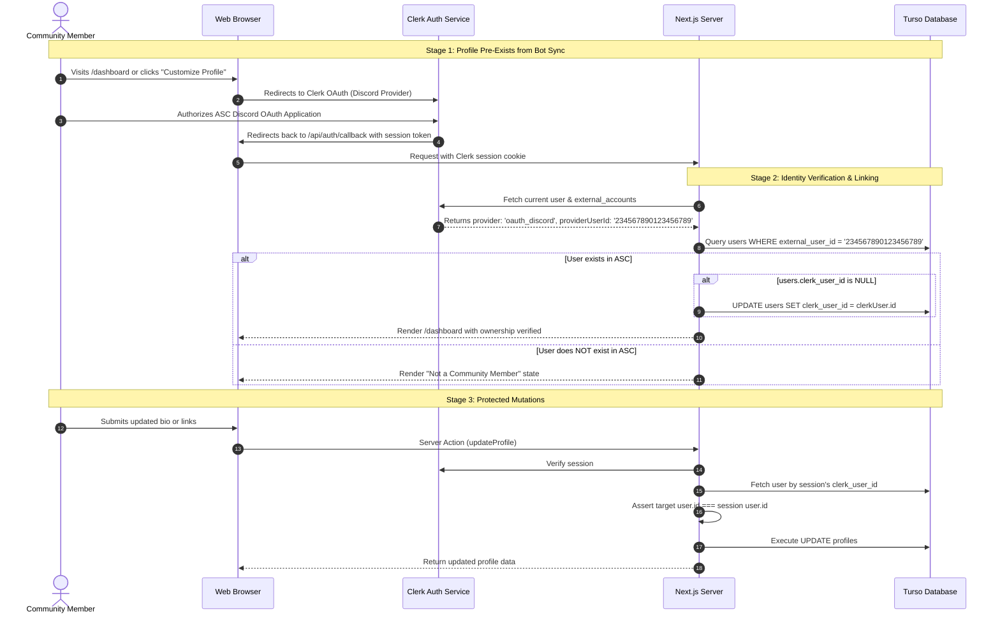

# ASC — Identity & Authentication Specification

## 1. The Core Invariant

ASC enforces a strict separation of concerns across identity, presentation, routing, and authentication:

```text
┌────────────────────────────────────────────────────────┐
│  IMMUTABLE EXTERNAL USER ID  =  CANONICAL IDENTITY     │
│  USERNAME                    =  PRESENTATION           │
│  SLUG                        =  ROUTING                │
│  CLERK ID                    =  AUTHENTICATION LINK    │
└────────────────────────────────────────────────────────┘
```

---

## 2. Layer Definitions

### 2.1 Canonical Identity (`external_user_id`)
- **Format**: Discord Snowflake (64-bit integer as string, e.g. `'234567890123456789'`).
- **Nature**: Permanently immutable. Never changes for a given Discord user account.
- **Role in ASC**: Anchor for all relational integrity, ownership verification, and history.

### 2.2 Presentation (`username` & `display_name`)
- **Format**: Text strings from Discord.
- **Nature**: Mutable. Members change their Discord usernames and display names at will.
- **Role in ASC**: Display only. **Never used for authorization, ownership checks, or internal foreign keys.**

### 2.3 Routing (`slug`)
- **Format**: URL-safe alphanumeric slug (e.g. `necookie`, `dheyn`).
- **Nature**: Managed in the `profile_slugs` table.
- **Role in ASC**: Maps incoming HTTP requests (`asc.necookie.dev/[slug]`) to an internal `user_id`. When a member changes their username, a new primary slug is minted, and previous slugs remain stored as historical aliases redirecting via `308 Permanent Redirect`.

### 2.4 Authentication Linkage (`clerk_user_id`)
- **Format**: Clerk User Identifier (e.g. `'user_2k7...'`).
- **Nature**: Created when a member signs in through Clerk OAuth.
- **Role in ASC**: Binds browser session cookies to the canonical ASC user record. Verified strictly by checking Clerk's external provider claims for matching `external_user_id`.

---

## 3. The End-to-End Authentication & Ownership Flow



---

## 4. Ownership Verification Rules

### Strict Anti-Spoofing Rules
1. **Never Trust Client-Provided User IDs**: The client cannot specify whose profile it is updating. The target user ID is resolved exclusively from the server-side Clerk session.
2. **Never Match by Username**: Even if two users share the same or similar username, ownership is determined solely by the verified `external_user_id` snowflake.
3. **Never Match by Slug**: Knowing or visiting a slug does not confer mutation rights.
4. **Never Fallback to Email Matching**: Email addresses can change or collide; only the Discord provider external ID is authoritative.

---

## 5. Lifecycle Edge Cases

### 5.1 Username Changes & Alias Migration
- When `dheyn` changes Discord username to `necookie`:
  1. The bot receives `userUpdate` or reconciles on guild fetch.
  2. Updates `users.username = 'necookie'`.
  3. Inserts new `profile_slugs` record: `slug: 'necookie'`, `is_primary: true`.
  4. Updates previous `profile_slugs` record: `is_primary: false`, `released_at: now`.
  5. Visiting `/dheyn` triggers a `308 Permanent Redirect` to `/necookie`.

### 5.2 Alias Conflict Resolution
- If Member B later takes the Discord username `dheyn`:
  - A historical alias (`released_at IS NOT NULL`) must never permanently block a legitimate current member.
  - Member B receives `/dheyn` as their primary slug.
  - Member A's stale alias `dheyn` is revoked (`released_at` tombstone).

### 5.3 Leaving & Rejoining the Community
- When a member leaves Discord:
  - `users.membership_status` becomes `'LEFT'`.
  - Active `membership_period` is closed with `left_at = now`.
  - Profile customization (bio, links, tags, theme) is **retained**.
  - Public profile shows a subtle "Former Member" banner while preserving links.
- When a member rejoins:
  - Status restored to `'ACTIVE'`.
  - A new `membership_period` row is created.
  - Profile remains customized without data loss.

### 5.4 Authorization Failures
- **401 Unauthorized**: Request lacks a valid Clerk session cookie. Redirects to `/login`.
- **403 Forbidden**: Authenticated user attempts to modify another user's profile, or a non-admin attempts to access `/admin`. Logged to security alerts.
