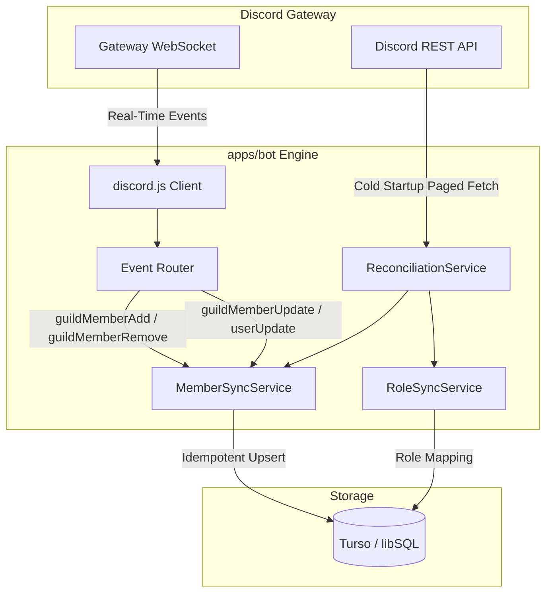

# ASC — Synchronization Subsystem Specification

## 1. Overview & Architecture

The Synchronization Subsystem (`apps/bot`) is an autonomous daemon that interfaces with the Discord Gateway using `discord.js`. It bridges the Discord community state to the Turso database, ensuring automatic profile generation, role tracking, supporter perks, and membership history.



---

## 2. Bot Startup Lifecycle

When the bot container starts:
1. **Initialize Gateway Client**: Requests `Guilds`, `GuildMembers`, and `GuildPresences` intents.
2. **Connect to Discord**: Authenticates with `DISCORD_TOKEN` and fetches the target `DISCORD_GUILD_ID`.
3. **Synchronize Roles**: Calls `RoleSyncService.syncAllRoles(guild)` to populate `community_roles` table with Discord role metadata (id, name, color, position, admin/mod/supporter flags).
4. **Initial Full Member Ingestion**:
   - Executes `guild.members.fetch()` in batches to retrieve all members.
   - For each member, calls `MemberSyncService.upsertMember(member)` within database transaction batches.
5. **Start Periodic Reconciliation Timer**:
   - Schedules background reconciliation every 12 hours (`SYNC_INTERVAL` default: 43,200,000 ms).
6. **Register Signal Handlers**: Captures `SIGINT` and `SIGTERM` for clean disconnect.

---

## 3. Real-Time Event Handlers

### 3.1 `guildMemberAdd` (New Member Join)
- Upserts member record in `users`:
  - `external_user_id`: `member.id`
  - `username`: `member.user.username`
  - `display_name`: `member.user.globalName || member.user.username`
  - `nickname`: `member.nickname`
  - `avatar`: `member.user.displayAvatarURL()`
  - `membership_status`: `'ACTIVE'`
  - `first_joined_at`: `member.joinedAt || now`
  - `last_synced_at`: `now`
- If user does not have a profile, creates default `profiles` record.
- If user does not have a primary slug, generates initial slug from sanitized username.
- Inserts new `membership_periods` record (`joined_at: now, left_at: null`).
- Synchronizes assigned roles in `member_roles`.

### 3.2 `guildMemberRemove` (Member Departure)
- Updates `users`:
  - `membership_status`: `'LEFT'`
  - `left_at`: `now`
- Closes the active `membership_periods` record by setting `left_at = now`.
- **Preserves existing profiles, slugs, tags, and links intact.**

### 3.3 `guildMemberUpdate` (Role, Nickname, or Avatar Change)
- Updates nickname and server-specific avatar if applicable.
- Reconciles assigned roles in `member_roles`:
  - Adds newly assigned roles.
  - Removes unassigned roles.
- Checks if supporter role status changed:
  - If supporter role gained: grant `'profile.background'`, `'profile.custom_title'` entitlements.
  - If supporter role lost: revoke or expire supporter entitlements (preserves saved profile data in DB, but disables public rendering).

### 3.4 `userUpdate` (Global Username or Global Avatar Change)
- Updates `users.username`, `users.display_name`, and `users.avatar`.
- If username changed:
  - Generates new primary slug in `profile_slugs`.
  - Marks previous primary slug with `is_primary = false` and `released_at = now` (for 308 redirect).

---

## 4. Periodic Reconciliation & Drift Healing

Even with WebSocket event streaming, network disconnects or missed events can cause data drift. The `ReconciliationService` guarantees eventual consistency:
1. Paginates all current guild members via Discord REST API.
2. Identifies:
   - **Missed joins**: Members present in Discord but marked `LEFT` or absent in ASC database.
   - **Missed departures**: Members marked `ACTIVE` in ASC database but absent in Discord guild.
   - **Stale metadata**: Outdated usernames, nicknames, avatars, or roles.
3. Batch updates database records to match Discord's authoritative state.

---

## 5. Idempotency & Repeat Safety

Every synchronization operation is strictly **idempotent**:
```text
f(event) == f(f(event))
```
- **Upserts instead of raw inserts**:
  - `INSERT INTO users (...) ON CONFLICT(external_user_id) DO UPDATE ...`
- **Membership Periods**:
  - A new membership period is inserted **only** if the user's latest period is already closed (`left_at IS NOT NULL`). Duplicate join events do not create multiple open periods.
- **Role Assignment**:
  - `INSERT INTO member_roles (...) ON CONFLICT(user_id, role_id) DO NOTHING`.
- **Slug Aliases**:
  - If the slug already exists for the user, update timestamps rather than throwing conflict errors.

---

## 6. Failure Recovery & Error Handling

1. **Discord API Rate Limits**:
   - Handled natively by `discord.js` request queue; logs warning if exponential backoff triggers.
2. **Turso Connection Loss**:
   - Failed database mutations are caught, logged with structured JSON context, and retried up to 3 times before deferring to the next reconciliation cycle.
3. **Graceful Shutdown**:
   ```typescript
   async function shutdown(signal: string) {
     logger.info(`Received ${signal}. Shutting down sync bot...`);
     clearInterval(reconTimer);
     client.destroy();
     process.exit(0);
   }
   ```
